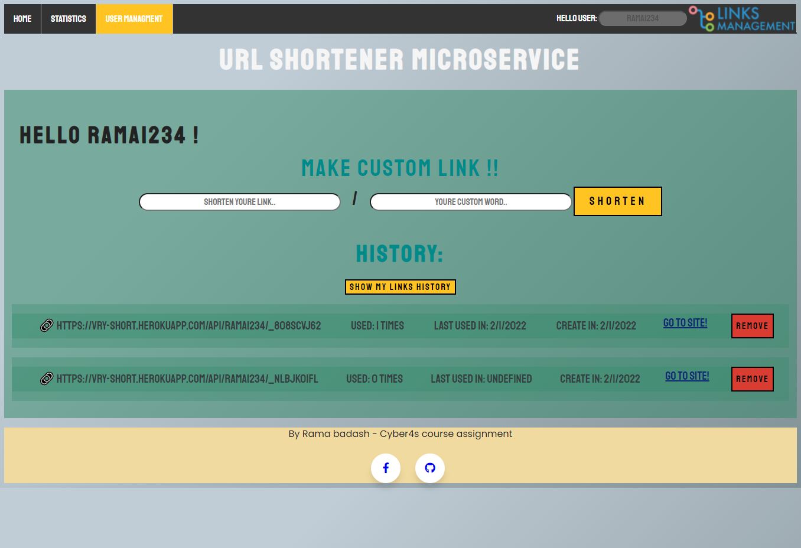

# Final 1 - URL shortner 📎

## A front-To-End solution to "URL shortner" web app.
### **written using-**
#### **Front**
* HTML - with webpack
* JS
* CSS
#### **End** 
* Node JS - with nodemon, express, path, fs, moment.
#### **Deploy** 
* Heroku deployment 
* **View my app! -  https://ramas-url-shortener.herokuapp.com/**

----
## Special things about development
---
### **Persistence DB -** 
* Using fs and path functionality.
* Based on a DB folder that contains json files customized for each user. 
* In addition a class that contains the relevant functionality for storing information about the url in the database.
* Avoid "wasting memory" by returning previously shortened links from DB instead of producing a new one

### **Generate Id for every url -** By using the simple code - ``` '_' + Math.random().toString(36).substr(2, 9) ```,
in order to produce a unique and yet not too long id. Based on a combination of numbers and letters with the sign "_".

### **Using Webpack for the front part**

----
## User Instructions
---
### **URL shortner**- The app is designed to allow the customer to shorten a long and inelegant address and use a short / custom address instead.

* ### Log in to the site by entering a username and using your own database or logging in as a guest to the site's general database of links.

* ### You can navigate with the help of the NAV-BAR at the top of the page between the functionality of the site -
* **Home page-** An address can be shortened by copying it to the input line and clicking a button. This service is also available to unregistered users.
* **Statistics-** You can write a short link provided by the site to get the following information about it: the date it was created, the number of times it was used, the original link from which it was created and its identity card.
* **User Managment-**
* If you want to use this service you must enter a username and click on the login button at the top of the page.
* You can use a database that is customized for you.
* You can create a custom link - you must provide a link plus a custom word and it will be returned to you accordingly.
* Clicking on the history button will display the short links provided to you and the date they were created.

* ### Special page for 404 error as a result of an incorrect shortcut, there are 2 options to return to the home page of the site or return to the user history.

----
## Exemple pics -
---- 





