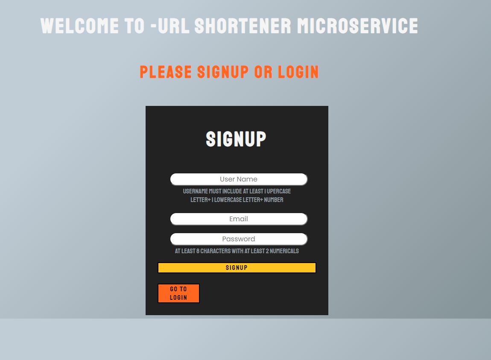

# Final 1 - URL shortner 📎

## A front-To-End solution to "URL shortner" web app.

      

---

### Technologies in use - 👩‍💻👨‍💻

#### **Frontend - | HTML | JS | CSS | Webpack |**

#### **BackEnd - | Node JS | MongoDB |**

#### Packages - 📦

- **Backend: [nodemon](https://www.npmjs.com/package/nodemon), [express](https://www.npmjs.com/package/express), [moment](https://momentjs.com/), [mongoose](https://mongoosejs.com/), [jwt](https://jwt.io/), [cookie-parser](https://www.npmjs.com/package/cookie-parser).**

#### **Deployment**

- **Heroku**

---

## My app -

---

## Global use - 🌎

#### ✨ Visit my app! - https://vry-short.herokuapp.com ✨

---

## Features - 💫

### The app is designed to allow the customer to shorten a long and inelegant address and use a short / custom address instead.

#### 🔹 SignUp and Login to the site by entering a username, password and email and using your own database

### You can navigate with the help of the NAV-BAR at the top of the page between the functionality of the site like :

#### 🔹 Home page- 🏠

- **An address can be shortened by copying it to the input line and clicking a button. This service is also available to unregistered users.**

#### 🔹 Statistics- 📊

- **You can write a short link provided by the site to get the following information about it: the date it was created, the number of times it was used, the original link from which it was created and its identity card.**

#### 🔹 User Management- 👥

- **You are using a database that is customized for you.**
- **You can create a custom link - you must provide a link plus a custom word and it will be returned to you accordingly.**
- **Clicking on the history button will display the short links provided to you and the date they were created.**
- **You can delete links from your history**

#### 🔹 Special page for 404 error as a result of an incorrect shortcut, there are 2 options to return to the home page of the site or return to the user history.

---

## Special things about development 💻⚙

### 🔹 **Persistence DB 🗂 - Using MongoDB and mongoose functionality.**

### 🔹 **Users Authentication -**

- **Login and registration page with username, password and email address**
- **Use JWT to create a unique token that allows the user to log in to the site and use it only after it has been approved as valid.**

### 🔹 **Encrypted passwords - Using bcrypt package to save hash passwords**

### 🔹 **Generate Id for every url -** By using the simple code in order to produce a unique and yet not too long id. Based on a combination of numbers and letters with the sign "\_" - `'_' + Math.random().toString(36).substr(2, 9)`

### 🔹 **Using Webpack for the front part 🌐 - Use 3 html pages and 3 different js pages for: Login page, homepage and dedicated page for address not found**

### 🔹 **Unique users count by their IP address when they redirect to the original address**

---

## Screenshots 📸 -

